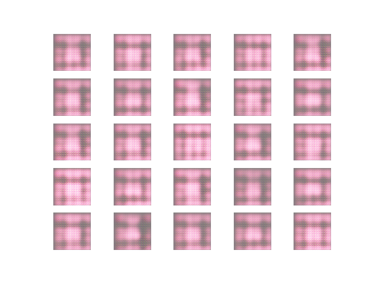
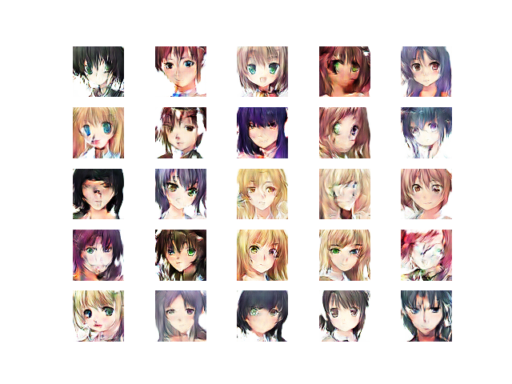
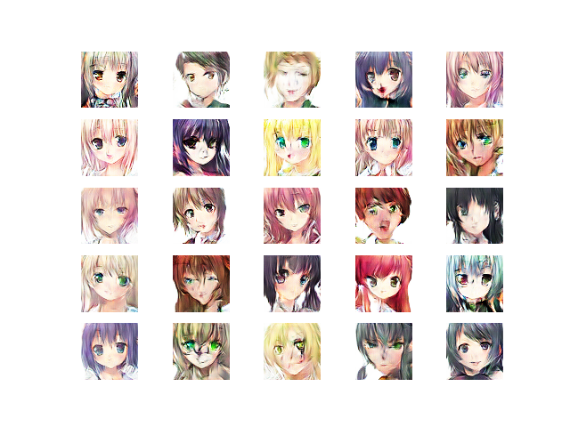

# DCGAN-on-Anime-Faces

The respository contains the code for the Deep Convolutional Generative Adversarial Network (DCGAN) trained on the anime faces dataset.  
  
There are two files:
- gan.py: It is used to train the DCGAN on the anime faces dataset.
- test.py: This file loads the saved generator model and generates some fake samples and save them with the name fake.png

## Training samples
|  |
|:--:| 
| *Image at epoch 1* |

|  |
|:--:| 
| *Image at epoch 60* |

## Fake samples generated after training

